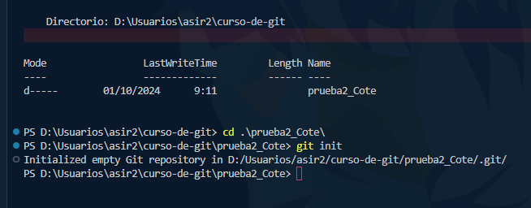
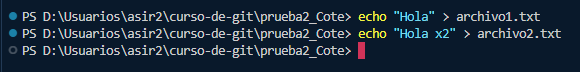
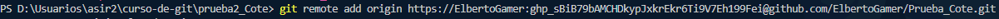
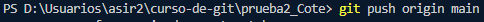
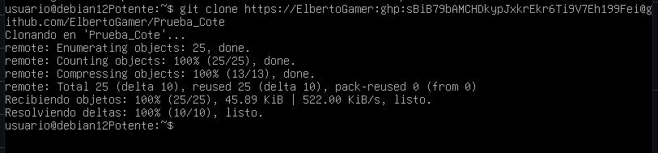
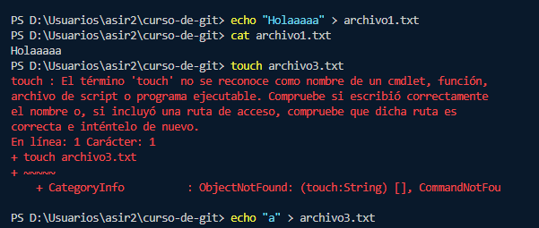
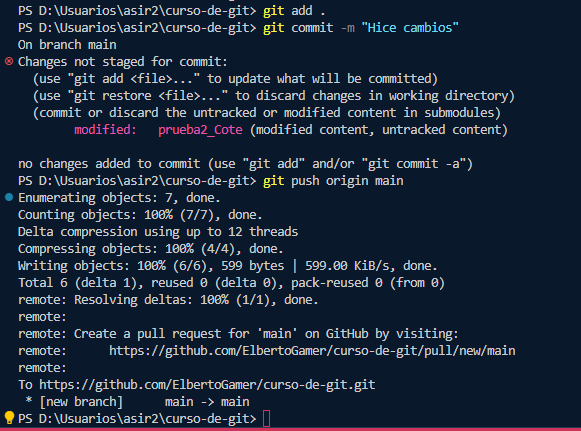
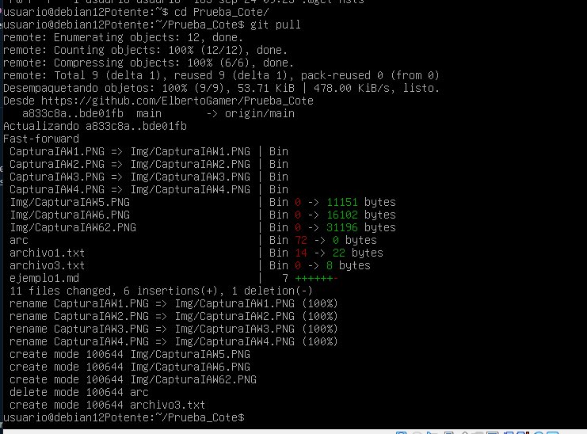

# Ejercicio 1 - Documentación del proceso

## Paso 1: Crear el repositorio local en Windows
- Creamos el repositorio local usando git init.

## Paso 2: Crear archivos de texto
- Creo los archivos archivo1.txt y archivo2.txt con el siguiente contenido:
  - archivo1.txt: "Este es el contenido de archivo1."
  - archivo2.txt: "Este es el contenido de archivo2."

## Paso 3: Conectar con GitHub
- Conecto el repositorio local con el remoto mediante git remote add origin.

## Paso 4: Subir el repositorio a GitHub
- Añado los archivos y se realizó el primer commit, seguido del push al repositorio remoto.

## Paso 5: Clonar el repositorio en Linux Debian
- Clono el repositorio en la máquina virtual Debian con git clone.

## Paso 6: Modificar archivos en Windows
- Modifico el archivo1.txt y creo el archivo3.txt, subiendo los cambios con git add, git commit y git push.

## Paso 7: Actualizar repositorio en Linux Debian
- Actualizo la versión local del repositorio en Linux Debian usando git pull.

